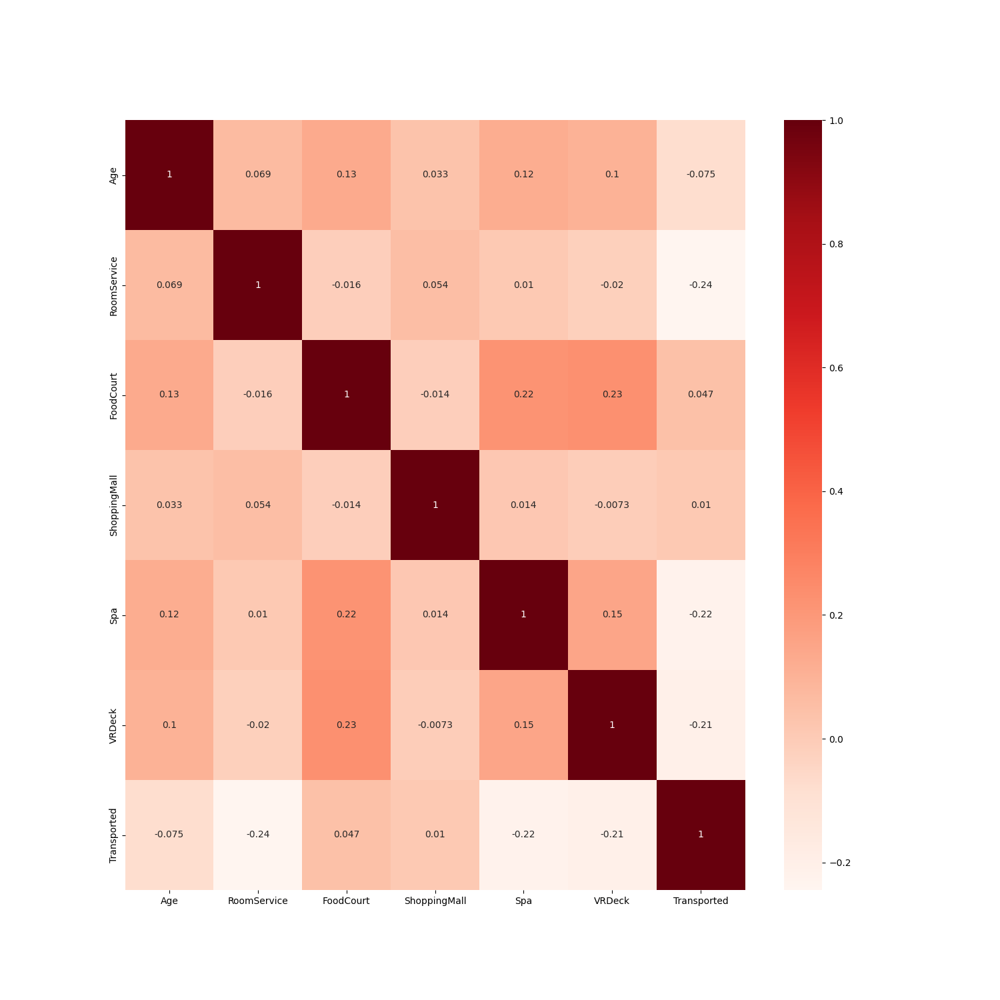
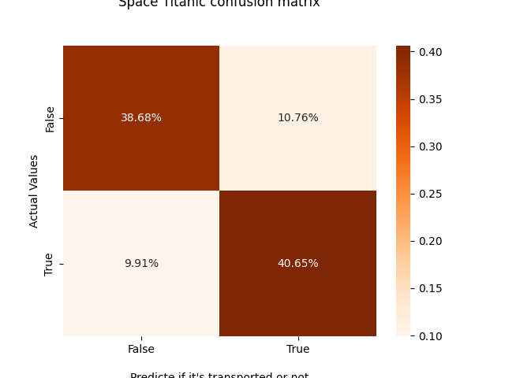

<h1> Space Titanic</h1>

<br>
<br>

    

---

## :palm_tree: Topic

Welcome to the year 2912, where your data science skills are needed to solve a cosmic mystery. We've received a transmission from four lightyears away and things aren't looking good.

The Spaceship Titanic was an interstellar passenger liner launched a month ago. With almost 13,000 passengers on board, the vessel set out on its maiden voyage transporting emigrants from our solar system to three newly habitable exoplanets orbiting nearby stars.

While rounding Alpha Centauri en route to its first destination—the torrid 55 Cancri E—the unwary Spaceship Titanic collided with a spacetime anomaly hidden within a dust cloud. Sadly, it met a similar fate as its namesake from 1000 years before. Though the ship stayed intact, almost half of the passengers were transported to an alternate dimension!

#### GOAL
To help rescue crews and retrieve the lost passengers, you are challenged to predict which passengers were transported by the anomaly using records recovered from the spaceship’s damaged computer system.


---

## :star2: Installation

<b>Step 1 : Install python</b>

https://www.python.org/downloads/

<b>Step 2 : Install the Python virtual environment package</b>

```bash
py -m pip install --user virtualenv
```
> you will need a virtual environment to run this code and install all the packages needed

<b>Step 3 : Clone the repository</b>

```bash
git clone https://github.com/Endy02/space_titanic.git
```

<b>Step 4 : Go in the project folder and create a new virtual environment</b>

```bash
cd space_titanic
```

```bash
py -m venv venv
```

> if 'py' doesn't work, try this :
>
> ```bash
> python -m venv venv
> ```
>Or
> ```bash
> python3 -m venv venv
> ```
> This will create a new virtual environment in the root directory

<b>Step 5 : Activate the virtual environment</b>

unix/osx

```bash
source venv/bin/activate
```

Windows
```bash
source venv/Scripts/activate
```

<b>Step 6 : Install all packages</b>

```bash
pip install -r requirements.txt
```

<b>Step 7 : Run the main script and check the plots</b>

```bash
py main.py
```
> To quit the plot just click on the "q" letter


---

## :link: Screenshots
Evaluation Accuracy score:

Kaggle competition:


Submissions:


---

## :bookmark_tabs: Usage

Open a new terminal and go in the project directory to run the script that use the api started earlier :

Go on the project directory:
```bash
cd space_titanic
```
 
Run the main script and check the plots:
```bash
py main.py
```

> <b>Reminder :</b>
> To quit a plot press the key "q"

This script that test the API endpoints will show informations in the terminal.

After the execution you will see a new CSV file named <b>"final_space_titanic.csv"</b> in the data folder:


---
## :computer: Analysis
| Accuracy Score | 79.33% |
| --- | --- |

Correlation Matrix:<br>

<br>
Confusion matrix:<br>



---

## :pencil: License

[](https://opensource.org/licenses/MIT)

